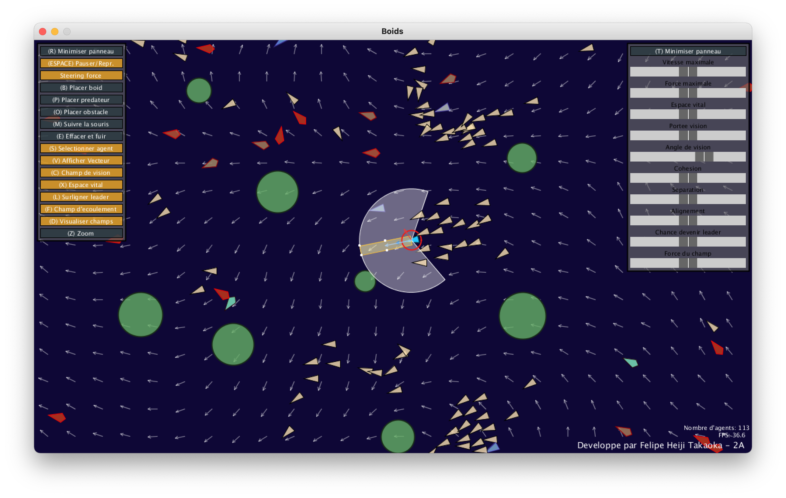

# Boids With Change in Leadership

Boids is a program, initially developped by Craig Reynolds, inteded to simulate the flocking behaviour of birds. It's commonly used in computer graphics providing realistic behaviour of schools of fish or herds of animals (besides birds).

This Processing implementation aims to introduce the effect of change in leadership described by Hartman and Benes. However, it doesn't exactly replicates the proposed algorithm. It has been slightly modified in the eccentricity definition (see below) and in the cange in velocity of the new leader.

Other functionalities have also been added. The environment dynamics include obstacle avoidance, wander behaviour, flow field, predator seek and flee, most of which have been described by Reynolds. It is also possible to adjust the environment dynamic parameters by buttons and sliders and visualizing the corresponding effect.

The code is mostly written in French. I intend to translate it in the near future.

## Getting Started 
To run the simulator, you should have **Processing 3** installed. Next, open **Boids/Boids.pde** and execute it in the Processing IDE.

## Functionalities

The graphical interface have two pannels: the left one activates different options whereas the right one adjusts some of the algorithms' parameters. The buttons can be activated by the shortcut inside parenthesis.

### Options Panel
* **(R) Minimiser panneau**: minimize the panel
* **(ESPACE) Pauser/Repr.**: pause or resume the simulation
* **Steering force**: (un)apply steering force
* **(B) Placer boid**: activate the option to place boids. User can either then click or click and slide on the screen
* **(P) Placer prédateur**: activate the option to place predators. User can either then click or click and slide on the screen
* **(O) Placer obstacle**: activate the option to place obstacles. User can either then click or click and slide on the screen
* **(M) Suivre la souris**: activate the seek force towards the mouse cursor (boids will follow your cursor)
* **(E) Effacer et fuir**: activate the option to erase elements (boids, predators or obstacles). Also, predators and boids will flee from your cursor. Good luck trying to erase them! User can either then click or click and slide on the screen
* **(S) Selectionner agent**: activate the option to select an agent/boid in order to visualize the vectors acting on it, its field of view and its field of separation (vital field)
* **(V) Afficher vecteur**: display vectors of velocity, acceleration, and the three main forces proposed by Reynolds
* **(C) Field of View**: display the field of view of the current agent selected
* **(X) Espace vital**: display the field of separation (vital field) of the current agent selected
* **(L) Surligner leader**: activate the option to color agents while they are leaders
* **(F) Champs d'écoulement**: activate the flow field and its force
* **(D) Visualiser champs**: visualize the flow field
* **(Z) Zoom**: allow to zoom when simulation is paused. User can move the display by clicking and sliding the cursor

### Parameters Panel
* **(T) Minimiser panneau**: minize the panel
* **Vitesse maximale**: adjust the maximum velocity allowed for the agens
* **Force maximale**: adjust the maximum force allowed for the agents
* **Espace vital**: adjust the radius of the field of separation of the agents
* **Portée vision**: adjust the range of the field of view
* **Angle de vision**: adjust the angle of the field of view
* **Cohésion**: adjust the weight of the cohesion force compared to the separation and alignment forces
* **Séparation**: adjust the weight of the separation force compared to the cohesion and alignment forces
* **Alignement**: adjust the weight of the alignment force compared to the cohesion and separation forces
* **Chance de devenir leader**: adjust the probility of the boid on becoming the leader of the group
* **Force du champs**: adjust the force of the vector field acting on the agents

## Modified Algorithm
The definition of eccentricity was modified for a couple of reasons (for more details, see the full report). The adopted formula, analogous to a Gaussian kernel, is provided below:

  

## Acknowledgements
This project was made by me as part of the course *Techniques Inspirées du Vivant* at CentraleSupélec, France, in 2017. The complete report (in French) is available in [assets/raport.pdf](assets/rapport.pdf).

I am not a native english speaker neither a native french speaker. So I apologize in advance if there are any grammar errors.

## References
* Reynolds CW. "Flocks, herds and schools: a distributed behavioral model." In SIGGRAPH’87: Proceedings of the 14th Annual Conference on Computer Graphics and Interactive Techniques. ACM Press: New York, 1987; 25–34.
* Hartman C, Benes B. "Autonomous boids." Computer Animation and Virtual Worlds 2006; 17: 199–206.
* Reynolds C. Steering behaviors for autonomous characters. In Proceedings of Game Developers Conference 1999; 763–782.